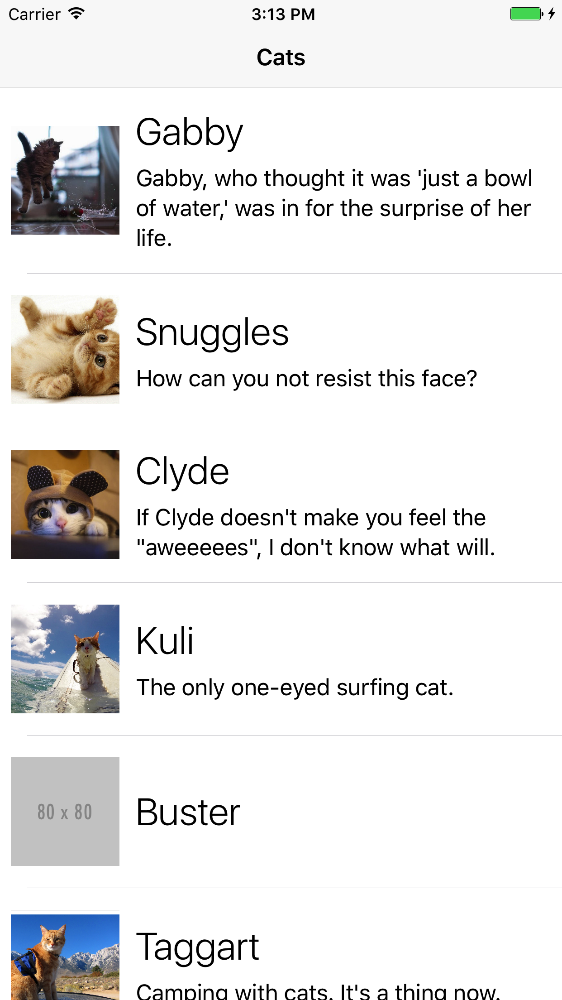

# Applying to MJD

First of all, thank you for taking the time to apply for a position here at MJD. We love it here and we think you will, too.

This small Xcode project is for you to give us a glimpse into your capabilities as an iOS engineer. We've given you a shell of an application that covers some general concepts of day-to-day iOS development. Certain portions of the application will require you to architect and implement code, fix bugs, and even implement features of your own.

There are a few things you should know before you begin...
- Please commit your project to to a public git repo. The first commit should be the project template we've provided you. This will be part of the submission process.
- Each target has been included in the project for a reason, so make use of them.
- We've included a simple networking class - `APIClient` - to connect to our API endpoint(s) and return the necessary data.
- All code in the project is fair game. Add, remove, and fix as you see fit.
- We've included a screenshot to use as a design specification.
- Please use your own code - there's no need for third party libraries.

## Submitting Your Application
- Please don't exceed more than one hour. This task is to gauge your experience level - we don't expect you to complete every aspect of the project.
- Take note of things you should or could have done but didn't have time for - include them in your introduction and we can go over these in the interview.
- When you're ready, POST a json body to `https://careers.mjdinteractive.com/application`
    - all fields are required:
        - `firstName`
        - `lastName`
        - `email`
        - `phone`
        - `address`
        - `projectRepo` - this is the public URL pointing to your project.
        - `resumeURL`
        - `position` - The position you're applying for.
        - `introduction` - A short introduction - tell us about yourself.
    - Upon a successful POST, you'll receive a 200 status code and message indicating your application is complete. We'll be in touch.
    - Should you run into any problems, please contact <careers@mjdinteractive.com>

---

# Design Specification

